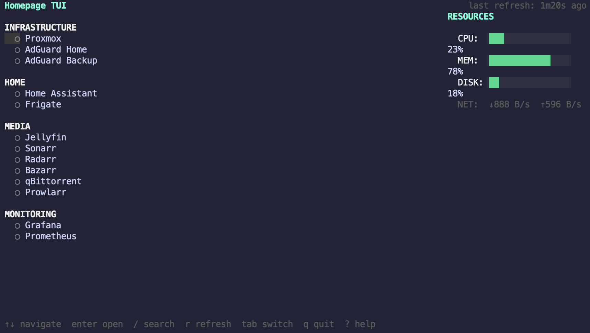

# Homepage TUI

A terminal dashboard for [gethomepage/homepage](https://github.com/gethomepage/homepage). See your services and system resources without leaving the terminal.



## Features

- Live service status with auto-refresh
- System resources (CPU, memory, disk, network)
- Keyboard-driven navigation (vim bindings)
- Fuzzy search with `/`
- Open services in browser with `Enter`
- Responsive layout (side-by-side or stacked)
- Config change detection (auto-reloads when Homepage config changes)

## Install

```bash
go install github.com/dokicro/homepage-tui@latest
```

Or build from source:

```bash
git clone https://github.com/dokicro/homepage-tui.git
cd homepage-tui
go build -o homepage-tui .
```

## Setup

Create `~/.config/homepage-tui/config.yaml`:

```yaml
homepage_url: http://homepage.local:3000
refresh_interval: 30s
```

If your Homepage instance requires authentication:

```yaml
homepage_url: https://homepage.example.com
refresh_interval: 30s
auth:
  # Basic auth
  username: admin
  password: secret
  # Or custom headers
  headers:
    X-Api-Key: your-key
    Authorization: "Bearer your-token"
```

Then run:

```bash
homepage-tui
```

Config is searched in order: CLI argument > `./config.yaml` > `~/.config/homepage-tui/config.yaml`

## Keybindings

| Key | Action |
|-----|--------|
| `j` / `k` | Navigate up/down |
| `Enter` | Open service in browser |
| `/` | Search services |
| `Esc` | Clear search |
| `r` | Force refresh |
| `Tab` | Switch panel focus |
| `?` | Help |
| `q` | Quit |

## How it works

Connects to your running Homepage instance via its API -- no config duplication needed. Polls these endpoints:

- `/api/services` -- service list and groups
- `/api/siteMonitor` -- HTTP status and latency per service
- `/api/docker/status` -- container status
- `/api/widgets/resources` -- CPU, memory, disk, network
- `/api/hash` -- config change detection

## Built with

- [Bubbletea](https://github.com/charmbracelet/bubbletea) -- TUI framework
- [Lipgloss](https://github.com/charmbracelet/lipgloss) -- Styling
- [gethomepage/homepage](https://github.com/gethomepage/homepage) -- The dashboard this connects to

## License

MIT
